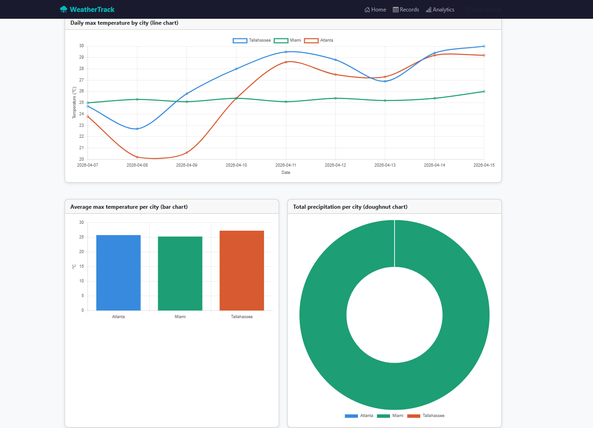

# Full-Stack Data Web Application with Django
 
## Group Members
 
| Name | Student ID | Role |
|---|---|---|
| Larry Shi | LJS22J | Views & Templates Lead |
| Nicolas Walker | NW24E | Models & Data Lead |
| Harsh Thakor | HJT24B | Frontend Lead |
 
## Project Description
 
This project is a full-stack Django web application that collects, stores, and visualizes daily weather data for three Florida-region cities: Tallahassee, Miami, and Atlanta. It builds on the automated data pipeline from Project 2, integrating the Open-Meteo API into a navigable website with CRUD functionality and an analytics dashboard powered by pandas and Chart.js.
 
The real-world purpose is to simulate how organizations track and analyze weather patterns over time for planning, forecasting, and decision-making.

## Links
 
- **Dataset:** Project 2 weather CSV (`data/raw/weather_data.csv`)
- **API Documentation:** https://open-meteo.com/en/docs
- **Archive API Documentation:** https://open-meteo.com/en/docs/historical-weather-api
## Application Features
 
| Page | URL | Description |
|---|---|---|
| Homepage | `/` | Overview of the app with stats and navigation |
| Records list | `/records/` | Paginated table of all weather records |
| Record detail | `/records/<pk>/` | Full detail view for a single record |
| Add record | `/records/add/` | Form to create a new weather record |
| Edit record | `/records/<pk>/edit/` | Form to update an existing record |
| Delete record | `/records/<pk>/delete/` | Confirmation page before deleting |
| Analytics | `/analytics/` | Pandas aggregations with Chart.js charts |
| Admin | `/admin/` | Django admin panel |
## Screenshots

### Homepage


### Records


### Analytics


## Setup Instructions
 
```bash
# 1. Clone the repo
git clone https://github.com/AbigailUhl/real-world-data-storytelling-group12.git
cd real-world-data-storytelling-group12/Project3-Full-Stack-Data-Web-Application-with-Django
 
# 2. Install dependencies
pip install -r requirements.txt
 
# 3. Create .env file in this folder with:
# SECRET_KEY=django-insecure-anyrandomstringhere123
# DEBUG=True
# ALLOWED_HOSTS=localhost,127.0.0.1
 
# 4. Run migrations
python manage.py migrate
 
# 5. Load CSV data into database
python manage.py seed_data
 
# 6. Start the server
python manage.py runserver
```
 
Then open `http://127.0.0.1:8000` in your browser.
 
## Data Pipeline
 
The `fetch_data` management command pulls fresh weather data from the Open-Meteo Archive API:
 
```bash
python manage.py fetch_data
```
 
This fetches the past 4 weeks of daily weather data for Tallahassee, Miami, and Atlanta in 7-day chunks, saving records to the database using `update_or_create` to avoid duplicates.
 
## Models
 
| Model | Description |
|---|---|
| `City` | Stores city name, latitude, longitude |
| `WeatherRecord` | Daily weather data linked to a City via ForeignKey |
| `DataRun` | Tracks each pipeline execution |
 
## Analytics
 
The dashboard at `/analytics/` answers three research questions from Project 1:
 
- **Q1:** How does temperature change over time? (line chart)
- **Q2:** Which city has the highest average temperature? (bar chart)
- **Q3:** Which city gets the most rain? (doughnut chart)

## Deploy Check
```
python manage.py check --deploy --settings=config.settings.prod
System check identified 3 issues (0 silenced).

WARNINGS:
?: (security.W005) SECURE_HSTS_INCLUDE_SUBDOMAINS not set to True.
?: (security.W009) SECRET_KEY is a development key — replace in production.
?: (security.W021) SECURE_HSTS_PRELOAD not set to True.

Note: All warnings, no critical errors.
```
## Scheduling
 
To run the pipeline automatically every day (Linux/Mac):
 
```
0 6 * * * python manage.py fetch_data
```
 
## Requirements
 
See `requirements.txt`. Key dependencies: Django, pandas, requests, python-decouple, gunicorn, whitenoise.

## Note on Dataset Continuity
 
This project builds on the weather data pipeline from Project 2 using the Open-Meteo API. The analytics dashboard answers research questions about temperature trends, city comparisons, and precipitation patterns across Tallahassee, Miami, and Atlanta.

## Video Walkthrough Summary
 
**Homepage** — The homepage at `/` shows the app name WeatherTrack in the navbar with links to Records and Analytics. Cards show the three cities tracked, the weather metrics collected, and that data comes live from the Open-Meteo API.
 
**Records page** — `/records/` shows a paginated table of all weather records. A search bar allows filtering by city name using GET parameters and Django Q objects. Each row links to a detail view showing all fields.
 
**CRUD** — The Add Record page at `/records/add/` uses a Django ModelForm with Bootstrap styling and validation. Editing and deleting records are also supported, with a confirmation page before deletion.
 
**Analytics dashboard** — `/analytics/` uses pandas to compute aggregations from the database and renders them as Chart.js charts:
- Summary statistics table (count, mean, min, max for all weather metrics)
- Line chart: how temperature changes over time per city
- Bar chart: which city has the highest average temperature
- Doughnut chart: total precipitation per city
**Admin panel** — `/admin/` shows all three models (Cities, Weather Records, Data Runs) with customized list display, search, and filters.
 
**Key code files:**
- `models.py` — City, WeatherRecord (with ForeignKey, choices, validators), DataRun
- `fetch_data.py` — pulls 4 weeks of data from Open-Meteo in 7-day chunks using update_or_create and retry logic
